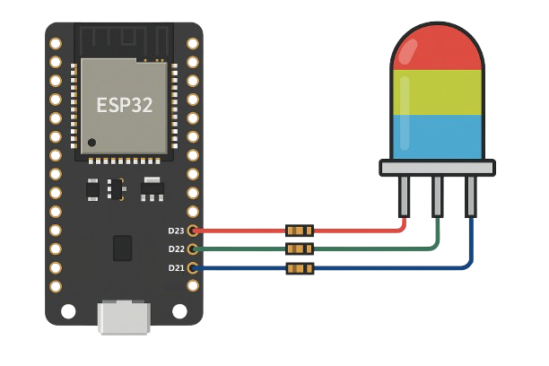

# Light Sign (Hand Gesture RGB LED Controller)

This project uses **real-time hand gesture recognition** with **MediaPipe** and **OpenCV** to control an **RGB LED**. It connects to an **ESP32** acting as its own Wi-Fi hotspot. You can adjust the Red, Green, and Blue color values of the LED wirelessly using simple hand movements detected by the system.

## Features

* **Real-time Gesture Detection:** Utilizes MediaPipe for accurate and fast hand landmark tracking.
* **Customizable Gesture Recognition:** Employs a `GradientBoostingClassifier` trained on a custom dataset (`gestures_dataset.csv`) to interpret specific hand gestures (e.g., "NUMBER_1" for Red, "THUMB_UP" for increment).
* **Wireless Communication:** ESP32 creates its own Wi-Fi hotspot, allowing any connected device to send commands.
* **HTTP-Based Control:** Python script sends color data (hexadecimal format) to the ESP32 via simple HTTP POST requests.
* **Dynamic RGB LED Control:** Adjust Red, Green, and Blue values independently.

## Technologies Used

* **Python 3.x**
* **MediaPipe:** For hand landmark detection.
* **OpenCV (**`cv2`**):** For camera interaction and visualization.
* **Scikit-learn:** For machine learning model training (`GradientBoostingClassifier`).
* **Pandas:** For data handling.
* **Requests:** For HTTP communication.
* **Joblib:** For saving and loading the trained machine learning model.
* **ESP32:** Microcontroller acting as a Wi-Fi Access Point and LED driver.
* **Arduino Framework:** For ESP32 programming.

## Setup and Installation

Follow these steps to get the project up and running on your system and ESP32 board.

**1. Python Environment Setup & Project Execution**
This section guides you through setting up the Python environment, installing dependencies, and running the gesture detection application.:

1. **Clone this repository**
Start by cloning the project to your local machine:

   ```bash
   git clone https://github.com/Abzikel/LightSign.git
   cd LightSign
   ```

2. **Install required dependencies**
Install all necessary Python libraries from the `requirements.txt` file:

   ```bash
   pip install -r requirements.txt
   ```

3. **Run the program**
Finally, launch the gesture detection application. Ensure you are connected to the ESP32's Wi-Fi hotspot BEFORE running this command in case you want to see the program working on a RGB LED.

   ```bash
   python3 detection.py
   ```

    (Note: If `python3` doesn't work, try `python` depending on your system configuration.)

**2. Customizing Your Gesture Dataset (Optional)**
If you wish to create your own gesture dataset or add new labels, follow these steps.

1. **Change label**
Open `create_dataset.py` and modify the `current_label` variable to the new gesture you want to record.

    ```bash
   current_label = "TESTING" # Example: "NUMBER_1"
   ```

2. **Execute the program**
Run the script to start collecting data for the specified label:

    ```bash
   python3 create_dataset.py
   ```

3. **Collect Data**

    * Perform the gesture you defined.
    * Press the `SPACE` bar to save each frame's hand landmark data to the DataFrame for the current label. Collect enough samples for robust training.

4. **Finish Collection**
When you are done collecting data for that specific label, press `ESC` to stop the program. The collected data will be stored in a CSV file within the `datasets` folder.

5. **Merge datasets**
After collecting data for all your desired labels, merge them into a single `gestures_dataset.csv` file for model training:

    ```bash
   python3 merge_dataset.py
   ```

    This merged file will then be used by `train_model.py`.

6. **Train the Machine Learning Model**
To train the gesture recognition model. This script will load your gestures_dataset.csv, train the GradientBoostingClassifier, and save the trained model as gesture_model.joblib. You only need to run this once, or whenever your dataset changes.

    ```bash
   python3 train_model.py
   ```

**3. ESP32 Program Upload**
This section details how to compile and upload the ESP32 firmware using PlatformIO.

1. **Open ESP32 Firmware in PlatformIO**
Navigate to the `rgb_controller/` directory within your project in PlatformIO IDE or VS Code with the PlatformIO extension. This folder contains the `platformio.ini` file and the source code.

2. **Verify ESP32 Libraries**
Ensure your PlatformIO environment has the necessary libraries for the ESP32 web server:

    * `WiFi.h` (comes with ESP32 Arduino Core)
    * `WebServer.h` (comes with ESP32 Arduino Core)

3. **Configure Wi-Fi Hotspot Credentials**
Open `rgb_controller/src/main.cpp` and modify the `ssid` and `password` variables to your desired Wi-Fi hotspot name and password. **The password must be at least 8 characters long.**

    ```bash
   const char* ssid = "YOUR_HOTSPOT_NAME"; // e.g., "ESP32_LED_Hotspot"
    const char* password = "YOUR_PASSWORD";  // Must be at least 8 characters
   ```

4. **Upload to ESP32 Board**
Connect your ESP32 board to your computer via USB. In PlatformIO, click the "Upload" button (the right arrow icon) or run the `PlatformIO: Upload` command from the VS Code Command Palette (`Ctrl+Shift+P`).

## How to use

1. **Select Channel:** ("NUMBER_1" for Red, "NUMBER_2" for Green, "NUMBER_3" for Blue)
2. **Adjust Color Value:** ("THUMB_UP" to increase, "THUMB_DOWN" to decrease)
3. **Observe the LED:** If you have an ESP32 connected via WIFI you can check the LED to see the changes in real life.
4. **Exit:** (`ESC` key)

## Technical Documentation

**1. MediaPipe Hand Landmark Selection**


*Image obtained from [MediaPipe Hands Documentation](https://mediapipe.readthedocs.io/en/latest/solutions/hands.html)*

To ensure accurate gesture recognition, specific hand landmarks are crucial for normalization and feature extraction. I utilize the following key points provided by MediaPipe's hand tracking model:

* `WRIST` **(Landmark 0):** Used as the origin point for normalizing all other landmark coordinates. This makes the gesture robust to hand size and distance from the camera.
* `THUMB_TIP` **(Landmark 4):** Essential for identifying thumb-related gestures (e.g., "THUMB_UP", "THUMB_DOWN").
* `INDEX_TIP` **(Landmark 8):** Key for numerical gestures (e.g., "NUMBER_1") and general finger extensions.
* `MIDDLE_TIP` **(Landmark 12):** Used in conjunction with other tips for numerical gestures (e.g., "NUMBER_2", "NUMBER_3").
* `MIDDLE_MCP` **(Landmark 9):** The metacarpophalangeal joint of the middle finger, used to calculate a dynamic scaling factor (`d = distance(wrist, middle_mcp)`) which further improves the robustness of the normalization against hand perspective changes.

**Why these points?** By normalizing coordinates relative to the `WRIST` and scaling by the `WRIST` to `MIDDLE_MCP` distance, the system becomes highly adaptable to varying camera distances and hand sizes, ensuring consistent gesture recognition.

**2. ESP32 - RGB LED Wiring Diagram**

To connect your RGB LED to the ESP32, follow this simple wiring diagram. Ensure you are using a Common Cathode RGB LED and resistors to protect your LED from excessive current (Minimum recommended 220Ω).



**Pin Connections:**

* **RED LED Pin:** ESP32 GPIO 23
* **GREEN LED Pin:** ESP32 GPIO 22
* **BLUE LED Pin:** ESP32 GPIO 21
* **Common Cathode** ESP32 GND

**3. Communication Protocol (Python to ESP32)**

The Python script communicates with the ESP32 via a simple HTTP POST request.

* **ESP32 Endpoint:** The ESP32 hosts a web server on its AP IP address (e.g., `192.168.4.1`) on port 80.
* **Color Endpoint:** The primary endpoint for color control is `/setColor`.
* **Request Method:** `POST`
* **Request Body:** The hexadecimal color code (e.g., `#FF00FF`) is sent directly in the plain text body of the POST request.

The ESP32's `handleColorChange` function parses this body and updates the LED PWM values accordingly.

## License

This project is open-source and available under the [LICENSE](./LICENSE)
